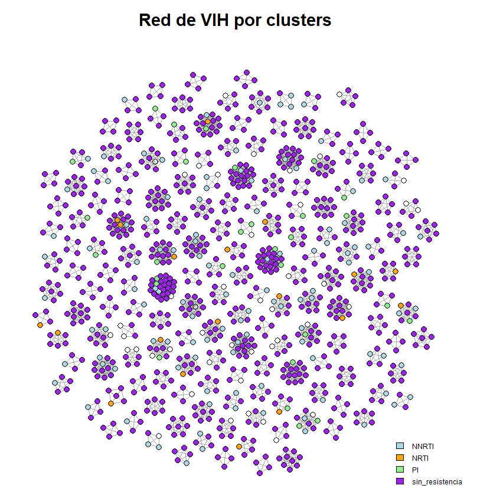
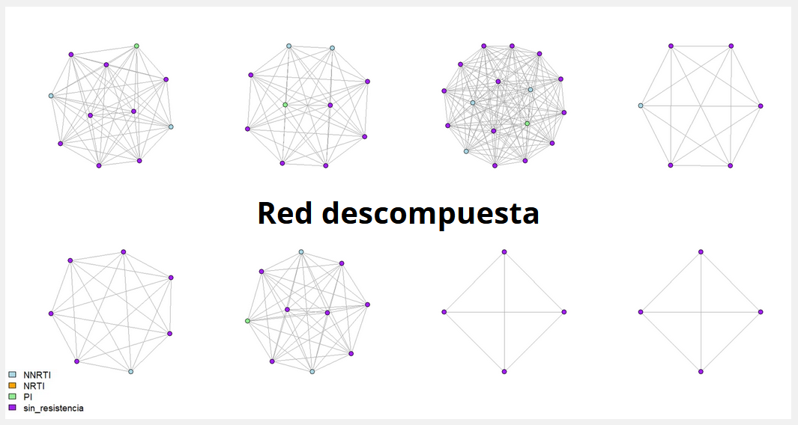
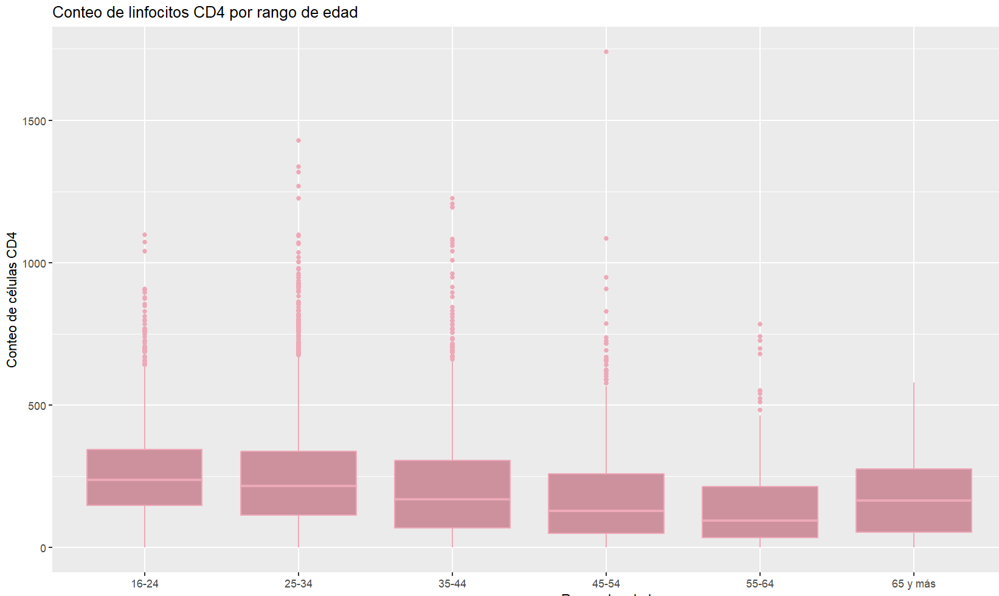
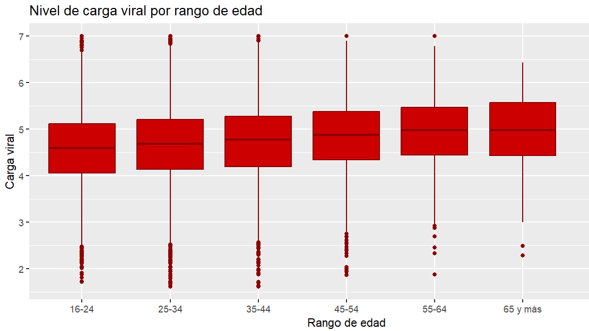

```{r setup, include=FALSE}
knitr::opts_chunk$set(echo = TRUE)
```

# RESIST-NET: Análisis de centralidad y topología de redes para la transmisión y resistencia del VIH

María Fernanda Pacheco Estrella & Diego Puente Rivera

### Introducción

El virus de inmunodeficiencia humana es un lentivirus responsable de causar la infección por VIH, si no es controlado a tiempo, provoca el desarrollo del síndrome de la inmunodeficiencia humana adquirida (SIDA), la cual es una enfermedad que progresa hacia el fallo del sistema inmune, permitiendo el desarrollo de infecciones oportunistas. (1)

El VIH se transmite con el contacto de fluidos corporales tales como: semen, sangre, flujo vaginal, líquido preseminal y leche materna. (1)Según el Sistema de Vigilancia Epidemiológica de VIH en el 2025 se registraron en México (hasta el tercer trimestre de este año) 16,323 nuevos casos, de los cuales 13,802 fueron hombre y 2,521 mujeres. (2) Los últimos datos disponibles en la página del gobierno son del 3er. trimestre del 2025, comparándolos con los datos del tercer trimestre del 2024, vemos un total de 2,224 casos nuevos en el 2025. (2)

La resistencia a los medicamentos puede desarrollarse con el tiempo en personas con el VIH o puede propagarse de persona a persona (lo que se conoce como resistencia transmitida). Con prueba de la carga viral se monitoriza si los medicamentos contra el VIH están funcionando eficazmente. Si la carga viral se mantiene estable, podría indicar que hay una resistenica, por lo que se opta por otro régimen de medicación. Hay distintos tipos de antirretrovirales como:

-   **NNRTI**: Inhibidores de la Transcriptasa Inversa No Nucleosídicos.

-   **NRTI**: Inhibidores de la Transcriptasa Inversa de Nucleósidos.

-   **INSTI**: Inhibidores de la Transferencia de Cadena de la Integrasa

-   **PI:** Inhibidores de la Proteasa

Para determinar el nivel de infección de un paciente se usa el conteo de linfocitos CD4 (Linfocitos T), que miide la fuerza de tu sistema inmunitario. Un rango normal va de 500 a 1,200 células/mm y se considera de riesgo un conteo por debajo de 200 células/mm. ( suele ser un indicador de SIDA). (3) También se usa la carga viral que mide la cantidad de VIH en la sangre, se espera que un paciente llegue a una carga viral "indetectable" (\<50 copias/mL).

### Objetivo general

-   Analizar la topología de la red de tranmisión del VIH e identificar perfiles clínico-demográficos mediante la correlación de la edad de los pacientes con sus niveles de linfocitos CD4 y carga viral, utilizando la base de datos del Sistema de Vigilancia Epidemiológica de México.

### Objetivos específicos

-   Limpiar y filtrar la base de datos obtenida de la Secretaria de Salud, eliminando los registros incompletos o con valores ausentes en variables críticas.

-   Reconstruir y describir la estructura topológica de la red de transmisión del VIH basada en los datos de conectividad previamente procesados.

-   Evaluar la distribución por edades y la condición del sistema inmunitario de los pacientes mediante el desarrollo de histogramas y gráficos estadísticos que comparen la edad de los individuos frente su conteo de células CD4.

-   Observar los datos proporcionados de la resistencia a antibióticos y ver el cambio según la fecha de toma de la muestra.

### 

### Metodología

Se cargaron bases de datos de <https://salud.conahcyt.mx/vih/estadisticas>, "Red de transmisión y vigilancia de farmacorresistencia del VIH en la CDMX" esta página contiene un análisis sobre la resistencia a antirretrovirales con una datos que obtuvieron mediante genotipificación de resistencia antirretroviral, adempas que hicieron la agrupación en clusters de transmisión se determinó con base en una distancia genética ≤1.5% entre secuencias y para determinar la resistencia antirretroviral fue clasificada siguiendo los criterios de la Universidad de Stanford.

De esa base de datos nosotros filtramos aquellos individuis que estuvieran en clusters y que estos clusters tengan ≥4 individuos y un conteo de linfocitos T CD4+ menor a 200 céls/µL, que es una medida considerada baja y propia de personas en una etapa aguda de la infección. La visualización de la red de transmisión se construyó en R con el paquete igraph, donde cada nodo representa una muestra y cada conexión refleja pertenencia al mismo cluster de transmisión, con nodos coloreados según el perfil de resistencia identificado.

```{r}
library(igraph)
library(dplyr)
library(tidyverse)

vih_data<-read.csv("vih_red_completa.csv")

vih_data_r <- vih_data$resistencia=="Sin resistencia"
vih_data$resistencia[vih_data_r] <- "sin_resistencia"

columnas_non <- c("colonia", "municipio", "cp", "seguridad_social") #crear un nuevo objeto en el que indiquemos las columnas que no necesitamos#

vih_data_limpia <-vih_data[, !names(vih_data) %in% columnas_non] #para no modificar nuestra base de datos original, creamos una nueva tabla, ahí indicamos de donde va a tomar los datos de las columnas a borrar#

#haremos la comparación de edad con varias categorías, así que vamos a eliminar aquellos datos que no tengan edad para que quede mejor la tabla#

vih_data_limpia <- vih_data_limpia[vih_data_limpia$edad != "", ]
#en la tabla no hay "0" o "NA", son simplemente espacios vacíos, por lo que en la base de datos limpia vamos a indicar de que columna queremos eliminar esos espacios vacíos#
```

```{r}
conexiones_buena <- vih_data_limpia %>%
  filter(cluster_id != 0 & cd4_a < 200) %>%    # Seleccionamos solo aquellos en clusters y con conteo de linfocitos CD4  mayor a 500
  group_by(cluster_id) %>%      # Agrupamos mediante este criterio
  filter(n() >= 4) %>%          # Excluye clusters con menos de 4 individuos
  summarise(pares = list(combn(id_muestra, 2, simplify = F))) %>% 
  # Nuevo df, "pares" que contiene las combinaciones del id según su cluster
  tidyr::unnest(pares) %>%  # Deshanida la lista anterior para que igraph pueda leerla
  mutate(from = sapply(pares, `[[`, 1),      # Genera dos nuevas columnas "from" y "to" 
         to   = sapply(pares, `[[`, 2)) %>%  # señalando de dónde sale y a dónde llega 
  select(from, to)            # Se descarta la columna "pares"   
```

Con este scrip generamos una base datos nueva que va a ser la base para hacer la red, dándonos como resultado dos columnas donde se indica de dónde sale la conexión y a dónde llega, basado en la cercanía de clusters

```{r}
g2 <- graph_from_data_frame(conexiones_buena, directed = F)
```

Generamos nuestra red con la base de datos modificada.

### Resultados

```{r eval=FALSE, include=FALSE}
layout <- layout_with_graphopt(g2, niter  = 15000, charge = 0.08)


plot(g2,
     vertex.label = NA,
     vertex.size = 3,
     vertex.color = colores[vih_data_limpia$resistencia],
     layout = layout,
     main = "Red de VIH por clusters")

legend("bottomright",
       legend = names(colores),
       fill   = colores,
       cex    = 0.5,
       bty    = "n")
```

{width="543"}

Con la construcción de la red, observamos que la mayor parte de los pacientes con inmunosupresión avanzada (CD4 \< 200) no presenta resistencia antirretroviral documentada.

Para poder observar mejor la topología de la red separando por grupo de clusters.

```{r eval=FALSE, include=FALSE}
par(mfrow = c(2, 4))

subg <- decompose(g2)

for (sg in subg) {
  plot(sg, vertex.label = NA,  vertex.size  = 8, 
       vertex.color = colores[vih_data_limpia$resistencia])
}

legend("bottomrleft",
       legend = names(colores),
       fill   = colores,
       cex    = 0.5,
       bty    = "n")

par(mfrow = c(1, 1))
```

](images/clipboard-2430740288.png)

En la parte estadística comparamos el conteo de los linfocitos T CD4 por el rango de edad.

```{r eval=FALSE, include=FALSE}
ggplot(vih_data_limpia, aes(x = edad_rango, y = cd4_a)) +
  geom_boxplot(fill = "pink3", color = "pink2") +
  labs(
    title = "Conteo de linfocitos CD4 por rango de edad", 
    x = "Rango de edad", 
    y = "Conteo de células CD4"
  ) 
```



Asimismo comparamos la carga viral con los rangos de edad:

```{r eval=FALSE, include=FALSE}

ggplot(vih_data_limpia, aes(x = edad_rango, y = cv)) +
  geom_boxplot(fill = "red3", color = "red4") +
  labs(
    title = "Nivel de carga viral por rango de edad", 
    x = "Rango de edad", 
    y = "Carga viral"
  ) 
```



Podemos observar en ambas gráficas que conforme aumenta la edad de los pacientes, el conteo de linfocitos T CD4 tiende a disminuir, manteniendo la carga viral en crecimiento a mayor rango de edad.

Finalmente comparamos la resistencia con la toma de muestra de cada paciente, sin embargo para poder hacerlo tuvimos que filtrar y limpiar nuevamente nuestra base de datos, en esta parte únicamente queríamos observar si había o no resistencia, realmente el tipo de resistencia no era tan relevante, por lo que el criterio de cambio fue:

1.  Sin resistencia es 0
2.  Cualquier tipo de resistencia es 1

Esto para poder tener ambos valores numéricos y graficar:

```{r}
tabla_resistencia <- data.frame(
  ID = vih_data_limpia$id_muestra,
  m_a = substr(vih_data_limpia$`fecha_toma`, 1, 7)
)

tabla_resistencia$Resistente[vih_data_limpia$resistencia == "sin_resistencia"] <- 0 
tabla_resistencia$Resistente[vih_data_limpia$resistencia == "NRTI"] <- 1
tabla_resistencia$Resistente[vih_data_limpia$resistencia == "NNRTI"] <- 1
tabla_resistencia$Resistente[vih_data_limpia$resistencia == "PI"] <- 1
tabla_resistencia$Resistente[vih_data_limpia$resistencia == "Compleja"] <- 1
tabla_resistencia$Resistente[vih_data_limpia$resistencia == "Pendiente"] <- 1

tabla_resistencia <- na.omit(tabla_resistencia)
```

Una vez que nuestra tabla estaba lista, hicimos una gráfica

```{r}
nuevos_casos <- ggplot(tabla_resistencia, aes(x = m_a, fill = as.factor(Resistente))) +
  geom_bar(position = "dodge") +
  labs(
    title = "Distribución Mensual de Casos con y sin resistencia",
    x = "Fecha de toma de muestra (Mes y Año)",
    y = "Número de pacientes"
  ) +
  scale_fill_manual(
    values = c("lightblue3", "red3"),
    labels = c("Sin resistencia", "Con resistencia")
  ) +
  theme(
    axis.text.x = element_text(angle = 45, hjust = 1),
    legend.position = "top"
  ) #aquí busque en Rpubs para ver como acomodar las etiquetas y que se entendieran
#y lo saqué de acá: Heiss, A. (2022, 23 junio). Quick and easy ways to deal with 
#long labels in ggplot2 | Andrew Heiss. Andrew Heiss.
#https://www-andrewheiss-com.translate.goog/blog/2022/06/23/long-labels-ggplot/?_x_tr_sl=en&_x_tr_tl=es&_x_tr_hl=es&_x_tr_pto=tc

print(nuevos_casos)
```

Se mantiene estable la resistencia a lo largo del tiempo, pero hay un pico pronunciado en el año 2021.

### Conclusiones

-   La resistencia a los medicamentos puede desarrollarse con el tiempo en personas con el VIH o puede propagarse de persona a persona.

<!-- -->

-   La gran mayoría de personas en este estudio, **no presentaron resistencia a farmacos** a pesar de tener un conteo de linfocitos muy reducido, lo que puede deberse a que son personas que no han recibido su tratamiento o que sea una etapa pronta de infección.

<!-- -->

-   El conteo de CD4 tiene una tendencia decreciente conforme avanza la edad, con medianas bajas en todos los grupos y mayor dispersión en los rangos jóvenes (16-34 años). Pero, la carga viral se mantiene relativamente estable y elevada (mediana \~log₁₀ 4.5-5.0) en todos los grupos de edad, con una ligera tendencia ascendente en los mayores de 55 años. Y en conjunto muestra un deterioro de salud enorme, posiblemente por una falta de consistencia en la medicación, un diagnóstico tardío.

### Referencias

1.  VIH y el SIDA: Conceptos básicos \| NIH. (s. f.-b). <https://hivinfo.nih.gov/es/understanding-hiv/fact-sheets/vih-y-el-sida-conceptos->\
    basicos

2.  Arellanos Jacinto, Y. [Coordinadora de los Sistemas de Vigilancia Epidemiológica de VIH y Sífilis Congénita], Mendoza Benítez, D.\
    [Médico Residente de la Especialidad en Epidemiología], & Vladimir Muñoz Hernández, E. [Médico Residente de la Especialidad en\
    Epidemiología]. (2025). Informe Histórico VIH DÍA MUNDIAL 2025: Sistema de Vigilancia Epidemiológica de VIH. En Gobierno de\
    México. Dirección General de Epidemiología. Recuperado 19 de mayo de 2026, de <https://www.gob.mx/cms/uploads/>\
    attachment/file/1040435/InformeHist_rico_VIH_DVEET_DIA_MUNDIAL2025.pdf

3.  Battistini Garcia SA, Zubair M, Guzman N. CD4 Cell Count and HIV. [Updated 2025 Jan 19]. In: StatPearls [Internet]. Treasure Island\
    (FL): StatPearls Publishing; 2026 Jan-. Available from: <https://www.ncbi.nlm.nih.gov/books/NBK513289/>
